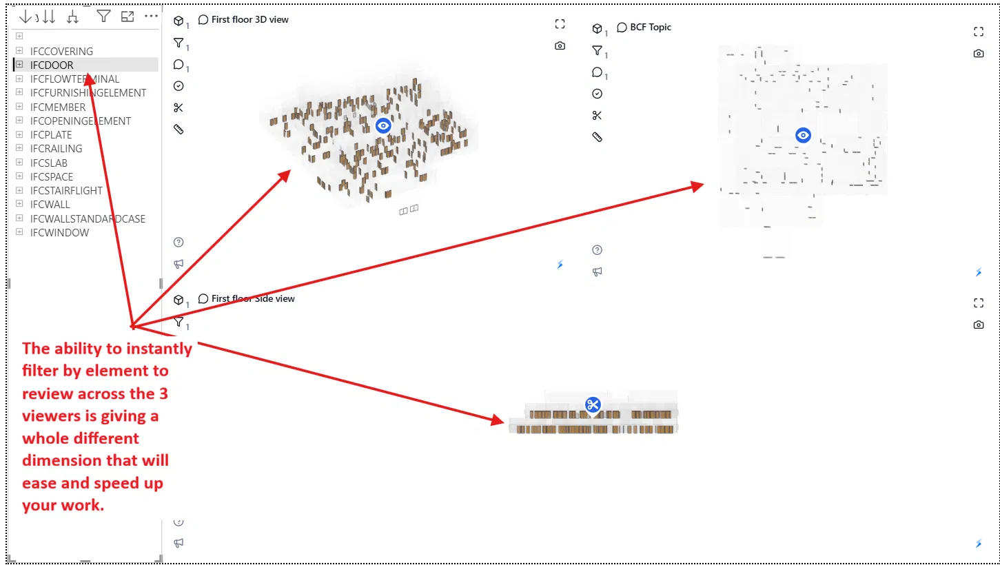
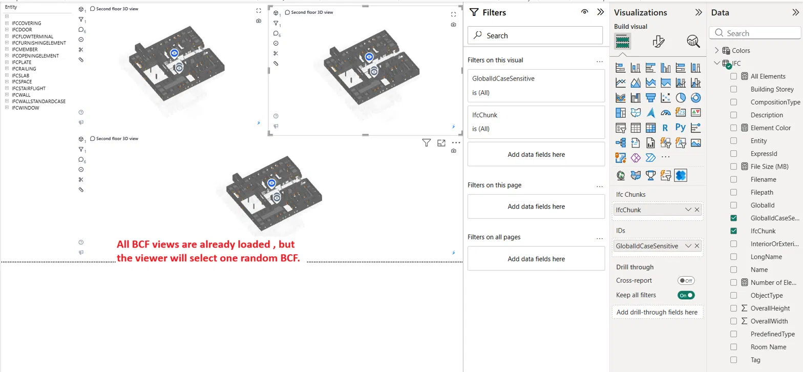
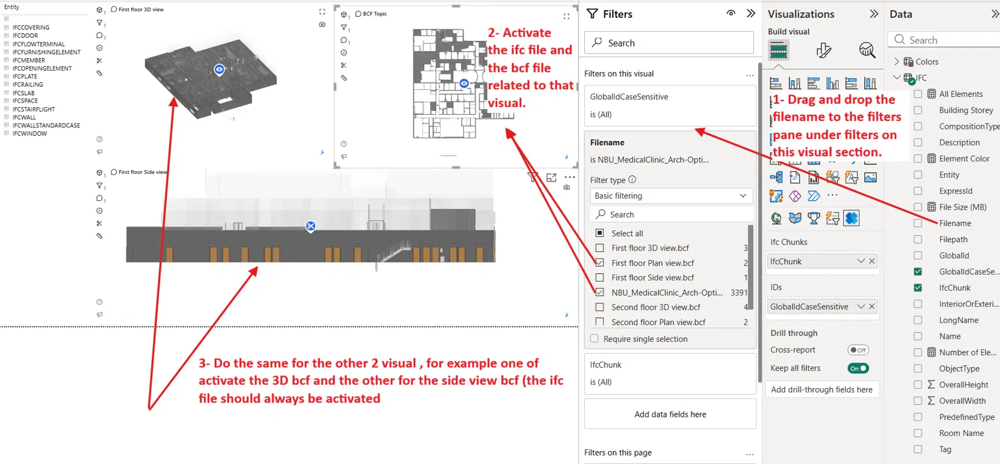
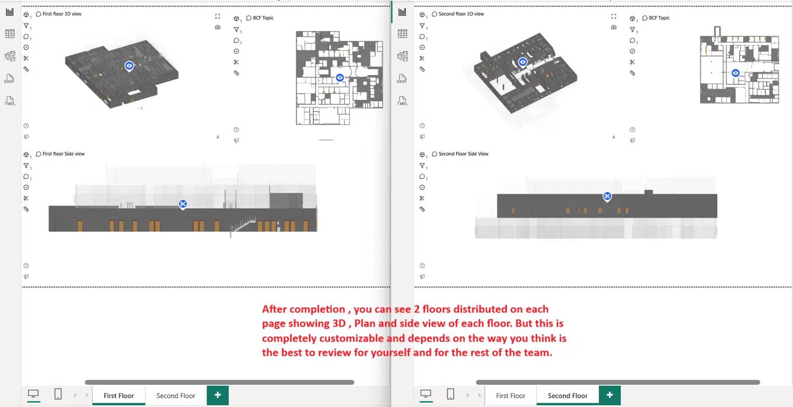

# 2D Section Views

<iframe title="ifcviewer-dev_SectionViews" style="width: 100%; aspect-ratio: 16 / 9;" src="https://app.powerbi.com/view?r=eyJrIjoiZDI3OTQzNWQtMGY0NC00NDg0LWIyNTAtOTEyODg0N2E4NDRhIiwidCI6IjQ0YjY0MGYzLTQ5YjAtNDMwNC05Yzk4LWM2MWQwYmMwZGMwMiJ9" frameborder="0" allowFullScreen="true"></iframe>

## Overview

The Flinker IFC Viewer applies one BCF viewpoint at a time. That single behaviour opens up a lot of practical uses — coordination walk-throughs, design reviews, punch-list navigation, and any workflow where a reviewer needs to see the model from predefined perspectives without touching camera controls.

This template shows how to combine that behaviour with Power BI's ability to place several viewers on the same page and filter each one independently. The result: 3D, plan, and section views of the same area sitting side by side, all driven by one shared IFC model.

## The example

The template ships with the **NBU Medical Clinic** IFC public model. On top of it, six BCF viewpoints are included, three per floor:

- **First Floor** — 3D, plan, and side view
- **Second Floor** — 3D, plan, and side view

Each viewpoint was authored in a different tool to show that all of them work: some in Navisworks, some in Solibri, and some directly inside the Flinker IFC Viewer (which can save BCFs too).

## Filter across all viewers at once

Because the three viewers on a page share the same underlying IFC data, filtering by an element type — for example all `IfcDoors` — instantly highlights them across the 3D, plan, and side views. This is a review dimension you don't get in a standalone viewer.

## How the setup works

When the page loads for the first time, every BCF viewpoint present in the data reaches every viewer. Each visual then picks one BCF at random — you can see the different viewers landing on different viewpoints.

The fix is a per-visual filter on the `Filename` column. For each viewer:

1. Drag the `Filename` field into the **Filters on this visual** section.
2. Activate the IFC model file (it should always be on).
3. Activate the one BCF file that viewer should display.

Repeat for each viewer — one gets the 3D BCF, another gets the plan BCF, another gets the side view BCF. Once saved, every visual will always render the same viewpoint.

## Final layout

The template ships with two pages — First Floor and Second Floor — each showing a 3D view, a plan view, and a side view of that floor.

This is an example arrangement, not a fixed one. Everything on the page can be reorganised: the number of viewers, their size, which BCFs feed which visual, and how many pages the report has.

## Authoring your own BCF viewpoints

Any BCF-compatible tool works with this template. The viewpoints shipped with the sample were authored in:

- **Autodesk Navisworks** — good for coordination reviews across federated models
- **Solibri Model Checker** — good for rule-based issue tracking
- **The Flinker IFC Viewer itself** — save any camera pose as a BCF directly from the browser or from within Power BI

Any of them produces a viewpoint file the template can load or any other tool.

## Multi-file loading

The template accepts more than one IFC through its file parameters, as well as more than one BCF. Either parameter can also point at a **folder URL** — every IFC or BCF inside is loaded automatically. This makes it straightforward to coordinate across MEP, Architecture, and Structural models in the same review, or to keep a growing BCF library without editing the report every time you author a new viewpoint.

## Customisation

The layout shown here is one example. The underlying capability — filtering a viewer visual to a specific IFC + BCF combination — is what you actually get from the template. From there, you decide:

- **How many viewers per page** and how they're arranged
- **Which combinations of viewpoints** to show side by side (only 3D isometrics, only plans, only sections, one page per issue, one page per discipline…)
- **Which BCFs to include** and how they're organised in the source folder
- **What else lives on the page** — Power BI tables, slicers, cards, or drill-through pages that complement the viewers

The template is a starting point. The rest depends on what the reviewer needs to see and how the team prefers to work through the model.
