> #### 🛡️ **Privacy First: Your Data Remains Secure!**
>  
> **No files or data are transferred or uploaded anywhere.**  
> **All permission management is handled directly within SharePoint, ensuring full privacy and security.** 🔐

> 🚨 **Admin Approval Needed!**
> This app requires admin approval in the SharePoint admin center.  

# Share App Installation with Admin Approval

This guide provides detailed steps for installing the Share App with admin approval.

```mermaid
flowchart LR
    subgraph SearchApp[Search App]
      style SearchApp fill:transparent,stroke:transparent,rounded
      A((🔍))
      style A fill:#f0f0f0,stroke:#f0f0f0,stroke-width:1px,rounded
    end

    subgraph RequestApp[Request]
      style RequestApp fill:transparent,stroke:transparent,rounded
      B((📝))
      style B fill:#f0f0f0,stroke:#f0f0f0,stroke-width:1px,rounded
    end

    subgraph AdminTasks[SharePoint Admin]
      style AdminTasks fill:#f9f9f9,stroke:#f9f9f9,stroke-width:1px,rounded
      subgraph AdminApproval[<br>Approves<br>App]
        style AdminApproval fill:transparent,stroke:transparent,rounded
        C{🚨}
        style C fill:#f0f0f0,stroke:#f0f0f0,stroke-width:1px,rounded
      end

      subgraph EnableAdd[Add To All Sites]
        style EnableAdd fill:transparent,stroke:transparent,rounded
        D((🌐🌐🌐))
        style D fill:#f0f0f0,stroke:#f0f0f0,stroke-width:1px,rounded
      end

      subgraph OnlyEnable[Only Enable]
        style OnlyEnable fill:transparent,stroke:transparent,rounded
        E((🔓))
        style E fill:#f0f0f0,stroke:#f0f0f0,stroke-width:1px,rounded
      end

        subgraph ManualAdd[Add To Specific Site]
        style ManualAdd fill:transparent,stroke:transparent,rounded
        F((🌐))
        style F fill:#f0f0f0,stroke:#f0f0f0,stroke-width:1px,rounded
        end
    end

    subgraph ManagePermissions[Use App]
      style ManagePermissions fill:transparent,stroke:transparent,rounded
      G((🔐))
      style G fill:#f0f0f0,stroke:#f0f0f0,stroke-width:1px,rounded
    end

    A --> B
    B --> C
    C --> D
    C --> E
    D --> G
    E --> F
    F --> G
```

## 1. Add Share App to Your Site

1. Navigate to the site where you want to install the app.
2. Go to "Site settings" and select "Add an app".

## 2. Search for Share App in the App Store

1. Navigate to the admin center.
2. Go to the App Store.
3. Use the search bar to type "Share App".

## 3. Request the Share App

1. Select the Share App from the search results.
2. Click on "Request" to proceed.

3. A confirmation message will appear indicating that your request has been sent.

<!---  -->

## 4. Approving the Pending Request

1. As an admin, go to the admin center.
2. Navigate to "Pending requests".
3. Locate the Share App request and click on "Approve".

4. If a confirmation dialog appears, you have two options:
    - Click "Enable and Add" to both approve and add the app to the site automatically.

    <!---  -->

    - Click "Only Enable" to enable the app without adding it automatically.

    <!---  -->

### If You Clicked "Only Enable"

1. The admin or site owner needs to manually add the app to the site.
2. Go to the site where you want to add the app.
3. Navigate to "My apps" and select "Share App".
4. Click on "Add" to add the Share App to the site.

## 6. Manage Permissions for the Share App

1. Navigate to the document library where your content is stored.
2. Select the folder or file for which you want to manage permissions.
3. Click on the three dots (**...**) next to the selected item to open the context menu.
4. Choose **Manage permissions** from the dropdown menu.
5. Adjust the permissions as needed for users or groups.
