> #### 🛡️ **Privacy First: Your Data Stays With You!**
> 
> **We do not upload your files anywhere.**  
> **All processing is client-side, ensuring full privacy and security.** 🔐

> 🚨 **Admin Approval Needed!**
> This app requires admin approval in the SharePoint admin center.  

# Viewer App Installation with Admin Approval

This guide provides detailed steps for installing the Viewer App with admin approval in SharePoint.

### Installation Steps

```mermaid
flowchart LR
    subgraph SearchApp[Search App]
      style SearchApp fill:transparent,stroke:transparent,rounded
      A((🔍))
      style A fill:#f0f0f0,stroke:#f0f0f0,stroke-width:1px,rounded
    end

    subgraph RequestApp[Request]
      style RequestApp fill:transparent,stroke:transparent,rounded
      B((📝))
      style B fill:#f0f0f0,stroke:#f0f0f0,stroke-width:1px,rounded
    end

    subgraph AdminTasks[SharePoint Admin]
      style AdminTasks fill:#f9f9f9,stroke:#f9f9f9,stroke-width:1px,rounded
      subgraph AdminApproval[<br>Approves<br>App]
        style AdminApproval fill:transparent,stroke:transparent,rounded
        C{🚨}
        style C fill:#f0f0f0,stroke:#f0f0f0,stroke-width:1px,rounded
      end

      subgraph EnableAdd[Add To All Sites]
        style EnableAdd fill:transparent,stroke:transparent,rounded
        D((🌐🌐🌐))
        style D fill:#f0f0f0,stroke:#f0f0f0,stroke-width:1px,rounded
      end

      subgraph OnlyEnable[Only Enable]
        style OnlyEnable fill:transparent,stroke:transparent,rounded
        E((🔓))
        style E fill:#f0f0f0,stroke:#f0f0f0,stroke-width:1px,rounded
      end

        subgraph ManualAdd[Add To Specific Site]
        style ManualAdd fill:transparent,stroke:transparent,rounded
        F((🌐))
        style F fill:#f0f0f0,stroke:#f0f0f0,stroke-width:1px,rounded
        end
    end

    subgraph ManagePermissions[Use App]
      style ManagePermissions fill:transparent,stroke:transparent,rounded
      G((🔐))
      style G fill:#f0f0f0,stroke:#f0f0f0,stroke-width:1px,rounded
    end

    A --> B
    B --> C
    C --> D
    C --> E
    D --> G
    E --> F
    F --> G
```

## 1. Add IFC Viewer App to a SharePoint Site

1. Go to the SharePoint site where you want to add the app.
2. Navigate to "Site settings" and select "Add an app".

## 2. Search for IFC Viewer in the SharePoint Store

1. Navigate to the SharePoint admin center.
2. Go to the SharePoint Store.
3. In the search bar, type "IFC Viewer".

## 3. Request IFC Viewer App

1. Select the IFC Viewer from the search results.
2. Click on "Request" to proceed.

3. A confirmation message will appear indicating that your request has been sent.

## 4. Approving the Pending Request

1. As an admin, go to the SharePoint admin center.
2. Navigate to "Pending requests".
3. Locate the IFC Viewer request and click on "Approve".

4. If a confirmation dialog appears, you have two options:
    - Click "Enable and Add" to both approve and add the app to the site automatically.

    

    - Click "Only Enable" to enable the app without adding it automatically.

    

### If You Clicked "Only Enable"

1. The admin or site owner needs to manually add the app to the SharePoint site.
2. Go to the SharePoint site where you want to add the app.
3. Navigate to "My apps" and select "IFC Viewer".
4. Click on "Add" to add the IFC Viewer app to the site.

## 5. Use IFC Viewer to Open an IFC File

1. Navigate to the document library where your IFC files are stored.
2. Select the IFC file you want to open.

3. Click on the IFC file to view it using the IFC Viewer.

Congratulations! You have successfully installed and started using the IFC Viewer app in SharePoint.
